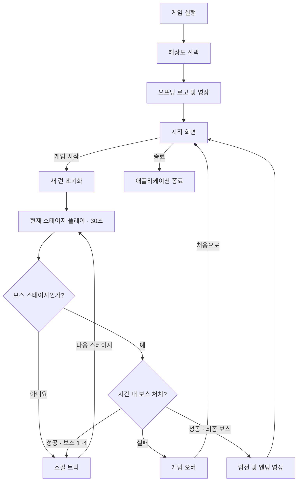
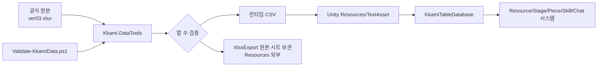

# 까미 스트리밍 시스템 기획서

> 문서 버전: 1.1  
> 작성 기준일: 2026-07-17  
> 기준 구현: Unity 프로젝트와 런타임 CSV의 현재 상태  
> 대상 씬: `Assets/Scenes/KkamiPrototype.unity`

## 1. 문서 목적

이 문서는 현재 구현된 **까미 스트리밍** 프로토타입의 게임 규칙, 화면 흐름, 데이터 구조, 밸런스 계산식과 소프트웨어 구조를 하나의 기준으로 정리한다.

문서에 `현재 구현`이라고 표시된 내용은 코드에서 확인된 실제 동작이다. `개선 필요` 항목은 현재 구현과 별개로, 정식 제작 전에 기획 또는 기술 결정을 내려야 하는 범위다.

## 2. 게임 개요

### 2.1 장르와 플레이 목표

- 장르: 2D 포인터 기반 자동 채굴 + 스테이지 진행 + 런 단위 성장
- 플레이 목표: 방송 장비 형태의 기물을 채굴해 스트리밍 자원을 모으고, 스테이지 사이의 스킬 트리에서 능력을 강화하여 50스테이지의 최종 보스를 처치한다.
- 한 런의 길이: 50개 스테이지 × 기본 30초를 중심으로 구성된다. 스킬 선택 시간과 연출 시간은 별도다.
- 핵심 성장 감각: 포인터 채굴 성능 강화 → 더 높은 체력의 기물 파괴 → 복수 자원 확보 → 매니저 자동 공격 해금 → 보스 처치.

### 2.2 핵심 플레이 원칙

1. 플레이어는 마우스 포인터를 움직여 채굴 위치를 지정한다.
2. 채굴 공격은 별도 클릭 없이 자동 반복된다.
3. 파괴한 기물 종류에 따라 6종 자원을 획득한다.
4. 30초가 끝나면 스킬 트리에서 자원을 소비해 강화한다.
5. 매 10번째 스테이지에서 보스를 제한 시간 안에 처치해야 한다.
6. 50스테이지 보스 처치 시 엔딩을 재생하고 런을 초기화한다.

## 3. 기술 및 실행 환경

| 구분 | 현재 사양 |
|---|---|
| 엔진 | Unity 6.3 LTS `6000.3.19f1` |
| 렌더 파이프라인 | Universal Render Pipeline 17.3.0 |
| UI | uGUI 2.0.0 + TextMesh Pro |
| 입력 | Unity Input System 1.19.0 |
| 기준 해상도 | 1920×1080 |
| 화면 비율 | 16:9 고정, 비율이 다른 화면은 카메라 레터박스/필러박스 적용 |
| UI 스케일 | `Scale With Screen Size`, `Expand` |
| 빌드 씬 | `Assets/Scenes/KkamiPrototype.unity` 1개 |
| 제품 버전 | 0.1.0 |
| 기본 플랫폼 성격 | 데스크톱 마우스 플레이 중심 |

실행 직후에는 1280×720, 1600×900, 1920×1080, 2560×1440, 3840×2160 중 모니터가 지원하는 해상도를 선택한다.

## 4. 전체 게임 흐름



### 4.1 상태별 규칙

| 상태 | 활성 시스템 | 종료 조건 | 다음 상태 |
|---|---|---|---|
| 해상도 선택 | 해상도 버튼 | 지원 해상도 선택 | 오프닝 |
| 오프닝 | 로고 페이드, `opening.mp4` | 영상 완료/오류/ESC 스킵 | 시작 화면 |
| 시작 화면 | 시작, 종료, 볼륨 버튼 | 시작 또는 종료 선택 | 게임/종료 |
| 스테이지 | 타이머, 채굴, 기물 스폰, 매니저, 채팅, 표정 | 30초 종료 또는 최종 보스 처치 | 스킬 트리/게임 오버/엔딩 |
| 스킬 트리 | 강화 구매, 줌/팬, 다음 스테이지 | 다음 스테이지 버튼 | 스테이지 |
| 게임 오버 | 처음으로 버튼 | 버튼 선택 | 시작 화면 |
| 엔딩 | 1초 암전, `ending.mp4`, 엔딩 BGM | 영상 완료/오류 | 시작 화면 |

## 5. 조작 체계

| 상황 | 입력 | 동작 |
|---|---|---|
| 스테이지 | 마우스 이동 | 채굴 커서 및 채굴 애니메이션 위치 변경 |
| 스테이지 | 입력 없음 | 포인터 위치에서 채굴 공격 자동 반복 |
| 스킬 트리 | 마우스 휠 | 0.6배~2.5배 줌 |
| 스킬 트리 | 확대 상태에서 좌클릭 드래그 | 스킬 트리 필드 이동 |
| 스킬 트리 | 스킬 버튼 클릭 | 조건과 비용 확인 후 강화 구매 |
| 시작 화면 | 볼륨 버튼 클릭 | 볼륨 슬라이더 열기/닫기 |
| 시작 화면 | 슬라이더 클릭/드래그 | 마스터 볼륨 0~100% 조절 |
| 오프닝 | ESC | 오프닝 스킵 요청 |

현재 게임 채굴 포인터는 `Mouse.current` 또는 레거시 마우스 입력을 사용한다. UI 슬라이더는 EventSystem 포인터 이벤트를 사용하지만, 전체 게임플레이의 터치 조작은 별도 검증이 필요하다.

## 6. 스테이지 시스템

### 6.1 기본 구성

- 총 스테이지: 50개
- 스테이지 ID: `40001`~`40050`
- 기본 제한 시간: 전 스테이지 30초
- 최초 배치 목표: 일반 기물과 보스를 합쳐 활성 기물 12개까지 채운다.
- 지속 스폰 간격: `0.30초 ÷ 기물 스폰 속도 배율`
- 지속 스폰에는 현재 별도 최대 개수 제한이 없다.
- 일반 기물끼리 겹쳐서 스폰될 수 있다.
- 스폰 영역은 씬의 `spawnpoint1`~`spawnpoint4`가 만드는 볼록 다각형이다.
- 일반 기물은 시각 크기의 네 모서리가 스폰 다각형 안에 들어오는 위치를 우선 사용한다.

### 6.2 구간별 콘텐츠

| 스테이지 | 배경 이미지 | 배경색 | 기본 등장 가중치 `키보드/카메라/드링크/상자/빨간상자` | 보스 |
|---|---|---|---|---|
| 1 | `img_stage1_01` | `#E7B5FD` | `1.0/0/0/0/0` | 없음 |
| 2~9 | `img_stage1_01` | `#E7B5FD` | `0.8/0.2/0/0/0` | 없음 |
| 10 | `img_stage1_01` | `#E7B5FD` | `0.8/0.2/0/0/0` | 보스 1 |
| 11~19 | `img_stage2_01` | `#10318E` | `0.6/0.2/0.2/0/0` | 없음 |
| 20 | `img_stage2_01` | `#10318E` | `0.6/0.2/0.2/0/0` | 보스 2 |
| 21~29 | `img_stage3_01` | `#8BD9F1` | `0.5/0.2/0.2/0.1/0` | 없음 |
| 30 | `img_stage3_01` | `#8BD9F1` | `0.5/0.2/0.2/0.1/0` | 보스 3 |
| 31~39 | `img_stage4_01` | `#31691D` | `0.4/0.2/0.2/0.2/0` | 없음 |
| 40 | `img_stage4_01` | `#31691D` | `0.4/0.2/0.2/0.2/0` | 보스 4 |
| 41~42 | `img_stage5_01` | `#4A3030` | `0.2/0.2/0.3/0.2/0.1` | 없음 |
| 43~44 | `img_stage5_01` | `#4A3030` | `0.2/0.2/0.2/0.3/0.1` | 없음 |
| 45~48 | `img_stage5_01` | `#4A3030` | `0.1/0.2/0.2/0.4/0.1` | 없음 |
| 49 | `img_stage5_01` | `#4A3030` | `0/0.2/0.2/0.4/0.2` | 없음 |
| 50 | `img_stage5_01` | `#4A3030` | `0/0.2/0.2/0.4/0.2` | 보스 5 |

스테이지 이미지는 전용 UI 셰이더를 통해 채도 0.82, 밝기 0.98이 적용된다.

### 6.3 스테이지 종료 판정

- 일반 스테이지: 타이머가 0이 되면 즉시 스킬 트리로 이동한다.
- 보스 스테이지: 타이머가 0일 때 보스가 살아 있으면 게임 오버다.
- 보스 1~4: 일찍 처치해도 남은 제한 시간은 계속 진행되며, 시간이 끝난 후 스킬 트리로 이동한다.
- 보스 5: 처치 즉시 엔딩 시퀀스를 시작하고 타이머 갱신을 중단한다.
- 스킬 트리로 이동할 때 남아 있는 모든 기물과 매니저 화면은 정리된다.

## 7. 채굴 및 전투 시스템

### 7.1 자동 채굴

- 채굴은 클릭 여부와 무관하게 포인터 위치에서 계속 실행된다.
- 공격 애니메이션: 12프레임
- 프레임 기본 시간: 0.025초
- 기본 1회 공격 주기: `12 × 0.025 = 0.30초`
- 피해 판정 시점: 12프레임 애니메이션 종료 시점
- 애니메이션 중 포인터가 이동하면 이펙트가 포인터를 따라가며, 종료 시점의 포인터 위치로 판정한다.
- 기본 채굴 반경: 120px
- 반경 안에 있는 모든 공격 가능 기물이 동시에 피해를 받는다.

### 7.2 피해 계산

```text
1회 채굴 피해 = 7 × 0.025 × 12 × 채굴 피해 배율
                = 2.1 × 채굴 피해 배율

1회 공격 시간 = 0.30초 ÷ 채굴 속도 배율

이론상 초당 피해량 = 7 × 채굴 속도 배율 × 채굴 피해 배율
```

스킬로 프레임 수는 바뀌지 않는다. 채굴 속도 스킬은 프레임 간격을 줄이고, 피해 스킬은 공격 1회의 피해량을 늘린다.

### 7.3 피격 및 파괴

- 기물 HP가 0 이하가 되면 파괴 처리한다.
- 일반 기물은 0.035초 축소 피드백 뒤 자원을 지급하고 제거한다.
- 피격 축소 효과는 중첩하지 않는다.
- 보스는 일반 파괴 대신 보스 전용 사망 애니메이션을 재생한 뒤 자원을 지급한다.
- 자원 획득 시 자원 아이콘 9개가 기물 위치에서 화면 상단 자원 표시 위치로 이동한다.

## 8. 자원 및 기물 시스템

### 8.1 자원 정의

| ID | 자원 | 주 획득처 | 주요 사용처 |
|---|---|---|---|
| 20001 | 팔로우 | 키보드 | 모든 초반 스킬 |
| 20002 | 조회수 | 카메라 | 중·후반 강화 |
| 20003 | 팬심 | 에너지 드링크 | 중·후반 강화 |
| 20004 | 도네이션 | 상자 | 고랭크 강화 |
| 20005 | 빨간 도네이션 | 빨간상자 | 최상위 강화 |
| 20006 | 정기구독자 | 보스 | 자원량/매니저 계열 핵심 강화 |

자원 값은 정수이며 음수가 될 수 없다. 비용 지불 전 6종 비용을 모두 확인한 후 각각 차감한다.

### 8.2 일반 기물과 보스 보상

| ID | 기물 | HP | 자원 ID | 기본 획득량 |
|---|---|---:|---:|---:|
| 10001 | 키보드 | 2 | 20001 | 1 |
| 10002 | 카메라 | 10 | 20002 | 1 |
| 10003 | 에너지 드링크 | 75 | 20003 | 1 |
| 10004 | 상자 | 200 | 20004 | 1 |
| 10005 | 빨간상자 | 400 | 20005 | 1 |
| 30001 | 보스 1 | 100 | 20006 | 1 |
| 30002 | 보스 2 | 200 | 20006 | 3 |
| 30003 | 보스 3 | 550 | 20006 | 5 |
| 30004 | 보스 4 | 2,100 | 20006 | 8 |
| 30005 | 보스 5 | 12,000 | 20006 | 100 |

실제 지급량은 다음 식으로 계산한다.

```text
지급량 = max(1, round(기본 획득량 × 자원 획득 배율))
```

자원 획득 배율은 일반 기물뿐 아니라 보스의 정기구독자 보상에도 적용된다.

## 9. 스킬 트리 시스템

### 9.1 진입과 조작

- 일반 스테이지 종료 또는 보스 1~4 스테이지 성공 후 열린다.
- 스킬 트리가 열린 동안 타이머, 채굴, 일반 기물 스폰은 정지한다.
- 휠로 0.6배~2.5배 확대/축소한다.
- 1배보다 확대된 상태에서 좌클릭 드래그로 필드를 이동할 수 있다.
- 스킬 툴팁은 포인터와 버튼을 가리지 않도록 네 모서리 후보 위치 중 하나를 선택한다.
- `NEXT STAGE` 버튼은 줌/팬 영향을 받지 않는 고정 UI다.

### 9.2 구매 조건

1. 같은 강화 타입의 이전 랭크가 있으면 이전 랭크를 최대 횟수까지 완료해야 한다.
2. `SD10117`~`SD10128`의 매니저 강화는 `SD10116` 매니저 활성화를 먼저 구매해야 한다.
3. 해당 구매 회차의 6종 자원 비용을 모두 보유해야 한다.
4. 스킬별 `upgrade_count`에 도달하면 완료 상태가 되고 더 구매할 수 없다.

### 9.3 비용 증가

데이터 테이블의 비용은 해당 스킬 첫 구매의 기본 비용이다. 같은 스킬을 반복 구매할 때 모든 자원 비용이 두 배씩 증가한다.

```text
현재 비용 = 기본 비용 × 2^(해당 스킬의 현재 구매 횟수)

예: 기본 팔로우 비용 10, 최대 3회 구매
    1회차 10 → 2회차 20 → 3회차 40
```

### 9.4 강화 타입

| 타입 | 키 범위 | 강화 내용 | 랭크별 1회 효과 | 스킬별 최대 구매 | 적용 방식 |
|---:|---|---|---|---|---|
| 1 | SD10101~103 | 채굴 속도 | +10% / +30% / +50% | 각 3회 | 현재 배율에 곱연산 |
| 2 | SD10104~106 | 채굴 범위 | +10% / +20% / +30% | 각 3회 | 현재 배율에 곱연산 |
| 3 | SD10107~109 | 채굴 피해 | +10% / +30% / +50% | 각 3회 | 랭크 기준 곱연산 |
| 4 | SD10110~112 | 기물 스폰 속도 | +10% / +30% / +50% | 각 2회 | 현재 배율에 곱연산 |
| 5 | SD10113~115 | 자원 획득량 | ×2 / ×2 / ×2 | 각 1회 | 현재 배율에 곱연산 |
| 6 | SD10116 | 까미 매니저 활성화 | 매니저 +1 | 1회 | 매니저 시스템 시작 |
| 7 | SD10117~119 | 매니저 공격 범위 | +10% / +20% / +30% | 각 3회 | 현재 배율에 곱연산 |
| 8 | SD10120~122 | 매니저 피해 | +10% / +30% / +50% | 각 3회 | 현재 배율에 곱연산 |
| 9 | SD10123~125 | 매니저 공격 속도 | +10% / +30% / +50% | 각 3회 | 공격 주기 감소 |
| 10 | SD10126~128 | 매니저 수 | 각 +1 | 각 1회 | 정수 가산 |

모든 퍼센트 강화는 합연산이 아니라 곱연산이다. 예를 들어 +10% 강화 3회는 `1.1 × 1.1 × 1.1 = 1.331배`가 된다.

### 9.5 기본 비용 요약

비용 표기 순서는 `팔로우/조회수/팬심/도네이션/빨간 도네이션/정기구독자`다.

| 강화 계열 | 랭크 1 기본 비용 | 랭크 2 기본 비용 | 랭크 3 기본 비용 |
|---|---|---|---|
| 채굴 속도 | 10/0/0/0/0/0 | 100/50/0/0/0/0 | 0/100/50/100/0/0 |
| 채굴 범위 | 10/0/0/0/0/0 | 100/50/0/0/0/0 | 0/100/50/100/100/0 |
| 채굴 피해 | 10/0/0/0/0/0 | 50/150/100/0/0/0 | 0/100/100/100/100/0 |
| 스폰 속도 | 100/0/0/0/0/0 | 100/200/300/0/0/0 | 0/200/200/100/100/0 |
| 자원 획득량 | 100/50/50/0/0/1 | 100/50/100/100/0/2 | 0/100/150/100/100/10 |
| 매니저 활성화 | 해당 없음 | 해당 없음 | 300/100/0/0/0/5 |
| 매니저 범위 | 50/0/0/0/0/0 | 100/100/0/0/0/0 | 0/150/100/100/0/10 |
| 매니저 피해 | 50/0/0/0/0/0 | 0/50/100/100/0/0 | 0/150/50/100/200/10 |
| 매니저 속도 | 100/0/0/0/0/0 | 0/50/100/0/0/0 | 0/150/200/100/0/0 |
| 매니저 +1 | 150/0/0/0/0/5 | 300/150/100/0/0/20 | 0/0/0/200/300/30 |

## 10. 까미 매니저 시스템

### 10.1 해금과 수량

- `SD10116` 구매 시 최초 매니저 1명이 활성화된다.
- `SD10126`, `SD10127`, `SD10128` 구매 시 각각 1명이 추가된다.
- 현재 최대 매니저 수는 4명이다.

### 10.2 동작

- 기본 공격 시도 주기: `0.8초 ÷ 매니저 속도 배율`
- 공격 주기는 최소 0.12초, 최대 2초로 제한한다.
- 공격 시 현재 포인터 위치에서 스폰 영역 중심/경계 방향으로 매니저 웨이브를 발사한다.
- 여러 매니저는 기본 방향, -20도, +20도 방향을 사용한다. 4번째 이후는 기본 방향을 다시 사용한다.
- 매니저 표시 이동 속도는 약 684px/s로 고정되며, 매니저 속도 스킬은 이동 속도가 아니라 공격 시도 주기에만 적용된다.
- 각 활성 매니저는 자기 위치에서 범위 안에 들어온 첫 번째 기물 하나를 공격한다.
- 기본 공격 범위: 120px

```text
매니저 1회 피해 = 7 × 0.025 × 12 × 매니저 피해 배율
                  = 2.1 × 매니저 피해 배율
```

## 11. 보스 시스템

### 11.1 공통 규칙

- 보스는 지정 스테이지에서 한 번만 생성된다.
- 일반 기물과 같은 HP/피격 시스템을 사용하고, 이동과 사망 애니메이션만 `BossPieceView`가 담당한다.
- 일반 기물보다 앞쪽에 표시되도록 sibling 순서를 지속적으로 보정한다.
- 이동 방향은 상·하·좌·우 중 선택하며, 바로 이전 방향의 완전한 반대 방향은 가능한 한 피한다.
- 스폰 포인트가 만드는 볼록 다각형을 이동 경계로 사용하고 경계에서 반사 경로를 계산한다.
- 사망 프레임 시간은 프레임당 0.0825초다.

### 11.2 보스별 패턴

| 보스 | 스테이지 | 표시 크기 | 이동/패턴 | 핵심 수치 | 사망 프레임 |
|---|---:|---:|---|---|---:|
| 보스 1 | 10 | 260 | 일반 이동 | 1초 대기, 342px 이동, 0.34초 이동 | 12 |
| 보스 2 | 20 | 312 | 가속감 있는 일반 이동 | 1초 대기, 684px 이동, 이동시간 0.45/0.32/0.22/0.14초 중 랜덤 | 12 |
| 보스 3 | 30 | 312 | 초고속 일반 이동 | 0.5초 대기, 684px 이동, 0.14초 이동 | 12 |
| 보스 4 | 40 | 260 | 잠복 | 0.7초 노출 → 잠복 연출 → 0.5초 비노출/무적 → 랜덤 위치 출현 | 16 |
| 보스 5 | 50 | 650 | 공중 이동 | 1초 대기, 0.28초 페이드아웃 → 342px 이동 → 0.28초 페이드인 | 16 |

보스 4는 출현·사망 표시를 2배 크기, Y축 +13px 오프셋으로 재생한다. 잠복 중에는 이미지가 숨겨지고 피격할 수 없다.

## 12. UI/UX 시스템

### 12.1 화면 구성

| 화면 | 주요 요소 |
|---|---|
| 해상도 선택 | 해상도 5종 버튼, 지원 여부 색상, 상태 문구 |
| 오프닝 | 검은 배경, 로고 밝기 페이드, 1920×1080 영상 |
| 시작 화면 | 배경, 게임 시작, 종료, 사운드 아이콘, 볼륨 슬라이더 |
| 게임 화면 | 스테이지, 자원 6종, 이미지 숫자 타이머, 스테이지 번호, 채굴 커서, 채팅, 까미 표정, 보스 처치 마크 |
| 스킬 트리 | 배경, 28개 스킬, 자원 지갑, 상세 툴팁, 보스 진행 표시, 다음 스테이지 |
| 게임 오버 | 게임 오버 배경, 처음으로 버튼 |
| 엔딩 | 1초 암전, 엔딩 영상 |

### 12.2 숫자 표시

- 자원과 타이머는 텍스트가 아니라 0~9와 구분점 스프라이트를 조합한 `PixelNumberLabel`을 사용한다.
- 숫자 1자리 크기: 34×54px
- 자릿수 간격: -6px
- `dotdot` 스프라이트를 `.`과 `:`에 공용으로 사용한다.
- 타이머 형식: `분:초`, 예: `0:30`

### 12.3 볼륨 UI

- 시작 화면 우상단 사운드 버튼을 클릭하면 버튼 아래에 가로 슬라이더가 열린다.
- 슬라이더 값은 0.0~1.0이며 `VOLUME 0%`~`VOLUME 100%`로 표시한다.
- 트랙 클릭과 핸들 드래그 모두 지원한다.
- 버튼 재클릭, 게임 시작 또는 시작 화면 재진입 시 패널을 닫는다.
- 변경 값은 `AudioListener.volume`에 즉시 반영한다.
- `PlayerPrefs` 키 `GameKamiStreaming.MasterVolume`로 저장하며 다음 실행 때 복원한다.

### 12.4 방송 연출

- 까미 표정: 6종 표정을 5초마다 변경하며 같은 표정의 연속 등장을 피한다.
- 표정 변경 시 1.06배 확대 후 원래 크기로 복귀한다.
- 채팅: 26개 문장을 데이터 가중치에 따라 2.2초마다 선택한다.
- 최근 채팅 최대 7줄을 유지하고 오래된 문장부터 제거한다.

## 13. 오디오 및 영상 시스템

### 13.1 BGM 매핑

| 상황 | 리소스 |
|---|---|
| 시작 화면, 스킬 트리, 스테이지 1~10 | `stage_01_10.wav` |
| 스테이지 11~20 | `stage_11_20.wav` |
| 스테이지 21~30 | `stage_21_30.wav` |
| 스테이지 31~40 | `stage_31_40.wav` |
| 스테이지 41~50 | `stage_41_50.wav` |
| 보스 1~5 전투 | `boss_10/20/30/40/50.wav` |
| 게임 오버 | `game_over.wav` |
| 엔딩 | `ending.wav` |

- 일반 BGM은 루프 재생한다.
- 보스 BGM은 실제 보스 스테이지 게임 화면에서만 사용한다. 같은 스테이지의 스킬 트리에서는 구간 일반 BGM을 사용한다.
- 엔딩 영상 자체의 오디오는 끄고 별도 엔딩 BGM을 재생한다.
- 엔딩 BGM 피치는 영상 길이에 맞추되 0.95~1.05 범위로 제한한다.
- 오프닝 영상은 `VideoAudioOutputMode.Direct`를 사용한다.

### 13.2 SFX

- 일반 UI 버튼 클릭음과 구매 불가능한 스킬 버튼 오류음을 구분한다.
- 모든 주요 Canvas의 `Button`에 런타임 클릭음 릴레이를 연결한다.
- 현재 기물 데이터의 `sound_id`는 비어 있어 기물별 피격/파괴 사운드는 사용하지 않는다.

## 14. 데이터 구조

### 14.1 데이터 흐름



런타임 CSV 위치:

`Assets/GameKamiStreaming/Resources/GameKamiStreaming/DataTables`

원본 시트 보관 CSV 위치:

`Assets/GameKamiStreaming/DataTables/XlsxExport`

### 14.2 런타임 테이블

| 테이블 | 행 수 | 주요 키/필드 | 사용 시스템 |
|---|---:|---|---|
| `currency.csv` | 6 | `resource_id`, 이름, 이미지 | 자원 지갑/UI |
| `piece.csv` | 10 | `piece_id`, 자원, 지급량, HP, 이미지 | 일반 기물/보스 |
| `stage.csv` | 50 | `stage_id`, 보스, 제한시간, 기물 가중치, 이미지 | 스테이지 진행/스폰 |
| `skilltree.csv` | 28 | 타일, 강화 타입, 랭크, 횟수, 효과, 비용 | 스킬 트리 |
| `stringkey.csv` | 28 | `string_id`, 스킬 설명 | 스킬 툴팁 |
| `chat.csv` | 26 | 대사, 등장 가중치, 이미지 ID | 방송 채팅 |
| `res_vfx.csv` | 10 | 이펙트 ID, 프리팹 경로 | 피격 이펙트 조회 |

### 14.3 ID 규칙

| 범위 | 의미 |
|---|---|
| 10001~10005 | 일반 기물 |
| 20001~20006 | 자원 |
| 30001~30005 | 보스 |
| 40001~40050 | 스테이지 |
| 50001~50028 | 스킬 타일 |
| 60001 이후 | 채팅 |
| SD10101~SD10128 | 스킬 문자열 키 |

### 14.4 CSV 로딩 규칙

- CSV는 `Resources.Load<TextAsset>`으로 로드한다.
- UTF-8 BOM이 첫 번째 헤더에 남지 않도록 파서에서 제거한다.
- 따옴표, 필드 내 쉼표, CRLF/LF를 지원한다.
- 누락된 정수/실수는 0으로 처리한다.
- 기물 HP는 최소 1, 스테이지 시간은 0 이하일 경우 30초로 보정한다.

## 15. 소프트웨어 구조

| 구성요소 | 책임 |
|---|---|
| `KkamiMaster` | 전체 상태 전환, UI 구성, 스폰, 채굴, 스킬, 매니저, 오디오/영상 총괄 |
| `KkamiTableDatabase` | CSV 로딩, 런타임 모델 생성, ID 조회 |
| `GameResourceManager` | 자원 보유량, 획득/차감, 변경 이벤트 |
| `GameStageManager` | 현재 스테이지 인덱스와 이동/선택 |
| `GamePieceManager` | 활성 기물 등록, 파괴 참조 정리, 일괄 제거 |
| `GameEffectManager` | 피격 프리팹 로드/캐시, 비중첩 피격 축소 |
| `StageProgressionRules` | 스테이지 종료 시 스킬 트리/게임 오버 판정 |
| `SkillProgressionRules` | 구매 비용, 선행 랭크, 매니저 해금, 배율 계산 |
| `DestructiblePieceView` | HP, 피격, 파괴, 자원 지급 이벤트 |
| `BossPieceView` | 보스 이동/잠복/공중 패턴과 사망 애니메이션 |
| `PixelNumberLabel` | 숫자 스프라이트 기반 값 표시 |
| `ResourceCounterView` | 자원 ID와 숫자 라벨 연결 |
| `KkamiPrototypeSceneBuilder` | 씬 생성, 편집 가능한 UI 보정, 스프라이트 임포트 설정 |
| `Kkami.DataTools` | XLSX→CSV 변환과 이미지 이름/메타 동기화 |
| `GameKamiStreaming.Tests.Editor` | CSV, 자원, 스테이지, 스킬 규칙 EditMode 테스트 |

현재 구조는 씬에 배치된 UI를 우선 사용하고, 누락된 오브젝트/컴포넌트는 런타임에 찾아 생성하는 혼합 방식이다.

## 16. 저장 및 초기화 정책

| 항목 | 저장 범위 | 초기화 시점 |
|---|---|---|
| 마스터 볼륨 | `PlayerPrefs`, 실행 간 유지 | 사용자가 다시 변경할 때까지 유지 |
| 자원 6종 | 현재 런 메모리 | 새 게임 시작, 게임 오버, 엔딩 완료 |
| 스킬 구매 횟수 | 현재 런 메모리 | 새 게임 시작, 게임 오버, 엔딩 완료 |
| 채굴/매니저 배율 | 현재 런 메모리 | 새 게임 시작, 게임 오버, 엔딩 완료 |
| 보스 처치 표시 | 현재 런 메모리/UI | 게임 오버 후 처음으로, 엔딩 완료 |
| 해상도 선택 | 별도 게임 저장 없음 | 실행할 때마다 다시 선택 |

중도 저장, 이어하기, 영구 성장 시스템은 현재 없다.

## 17. 주요 밸런스 상수

| 항목 | 현재 값 |
|---|---:|
| 스테이지 제한 시간 | 30초 |
| 최초 활성 기물 목표 | 12개 |
| 일반 기물 기본 스폰 간격 | 0.30초 |
| 일반 기물 원본 랜덤 크기 | 155~215px |
| 실제 표시 크기 배율 | 0.8 |
| 기본 채굴 반경 | 120px |
| 기본 채굴 DPS | 7 |
| 채굴 애니메이션 | 12프레임 × 0.025초 |
| 자원 수집 파티클 | 9개 |
| 매니저 기본 공격 시도 간격 | 0.8초 |
| 매니저 기본 반경 | 120px |
| 매니저 표시 이동 속도 | 약 684px/s |
| 채팅 갱신 | 2.2초 |
| 최대 채팅 줄 | 7줄 |
| 까미 표정 갱신 | 5초 |
| 스킬 트리 줌 | 0.6~2.5배 |
| 스킬 트리 줌 1단계 | 0.18 |

## 18. QA 수용 기준

### 18.1 실행 및 화면

- [ ] 지원되는 해상도를 선택하면 16:9 화면 비율로 오프닝이 시작된다.
- [ ] 오프닝 영상 완료, 영상 오류, ESC 스킵 모두 시작 화면으로 정상 전환된다.
- [ ] 시작 화면의 볼륨 버튼이 슬라이더를 열고 닫는다.
- [ ] 볼륨 드래그 값이 즉시 BGM/SFX에 반영되고 재실행 후 복원된다.

### 18.2 스테이지와 채굴

- [ ] 게임 시작 시 자원과 스킬이 0/기본 배율로 초기화된다.
- [ ] 일반 기물이 지정 스폰 다각형 안에서 생성된다.
- [ ] 포인터 이동만으로 12프레임 채굴이 반복되고 종료 프레임에 피해가 적용된다.
- [ ] 한 채굴 범위 안의 여러 기물이 동시에 피해를 받는다.
- [ ] 파괴된 기물의 자원과 화면 표시 값이 일치한다.
- [ ] 30초가 끝나면 일반 스테이지는 스킬 트리로 전환된다.

### 18.3 스킬과 매니저

- [ ] 반복 구매 비용이 기본 비용의 1배, 2배, 4배 순서로 증가한다.
- [ ] 이전 랭크 완료 전 다음 랭크를 살 수 없다.
- [ ] 매니저 활성화 전 매니저 후속 스킬을 살 수 없다.
- [ ] 매니저 활성화 후 웨이브 표시와 단일 대상 공격이 실행된다.
- [ ] 다음 스테이지에서도 구매한 강화와 남은 자원이 유지된다.

### 18.4 보스와 종료

- [ ] 10/20/30/40/50스테이지에서 지정 보스가 한 번만 생성된다.
- [ ] 보스 제한 시간 실패 시 게임 오버와 런 초기화가 발생한다.
- [ ] 보스 1~4 처치 시 정기구독자 보상과 처치 표시가 유지된다.
- [ ] 보스 4 잠복 중에는 공격이 적용되지 않는다.
- [ ] 보스 5 처치 시 1초 암전 후 엔딩 영상/BGM이 재생된다.
- [ ] 엔딩 종료 후 스테이지 1, 자원 0, 스킬 초기 상태로 시작 화면에 복귀한다.

## 19. 현재 구현의 제약 및 개선 필요 항목

### 19.1 기획 확정 필요

1. **지속 스폰 상한**: 최초 목표는 12개지만 이후 스폰에는 상한이 없다. 장시간 파괴하지 않을 때 기물 수와 부하가 계속 증가하므로 최대 활성 개수를 확정해야 한다.
2. **보스 조기 처치 보상**: 보스 1~4를 일찍 잡아도 타이머 종료까지 기다린다. 즉시 스킬 트리 이동, 잔여 시간 보너스 또는 계속 채굴 중 하나를 기획으로 확정해야 한다.
3. **해상도 UX**: 해상도 선택을 매 실행마다 강제한다. 마지막 선택 저장과 전체화면/창 모드 옵션 여부를 확정해야 한다.
4. **저장/이어하기**: 현재 런은 종료하면 복구할 수 없다. 예상 플레이 시간이 길어질 경우 중도 저장 정책이 필요하다.
5. **모바일 대응**: 게임플레이 포인터 로직은 마우스 중심이다. 모바일을 지원하려면 터치 위치, 멀티터치, 화면 비율과 성능 기준을 별도로 정의해야 한다.
6. **최종 난이도**: 보스 5 HP 12,000과 보상 100은 이전 보스 대비 급격히 증가한다. 50스테이지 도달 시 예상 DPS 시뮬레이션으로 검증해야 한다.

### 19.2 기술 개선 반영 현황

| 개선 항목 | 상태 | 반영 내용 또는 판단 |
|---|---|---|
| 중앙 컨트롤러 비대화 | 1차 완료 | 스테이지 종료와 스킬 계산을 순수 규칙 클래스로 분리했다. 화면, 전투, 오디오, 스폰 분리는 단계적으로 진행한다. |
| 자동 테스트 | 완료 | CSV 파싱, 자원 차감, 스테이지 종료, 스킬 비용/선행 조건 등 EditMode 테스트 15개를 추가했다. |
| VFX 데이터 연결 | 보류 | `prefab_path`에 연결할 승인된 프리팹이 없다. 임의 프리팹 생성은 연출 품질과 참조 안정성을 해칠 수 있다. |
| 미사용 데이터 필드 | 유지 | 향후 콘텐츠 계약 필드로 남기고 삭제하지 않는다. 사용 여부를 데이터 사전에 표시한다. |
| 데이터 원본 모호성 | 완료 | 인자 없는 기본 실행의 공식 원본을 `kkami_datatable_ver03.xlsx`로 고정했다. |
| XLSX 변환 검증 | 완료 | 변환 전 행/헤더 열 수를 검사하고, 별도 스크립트로 7개 테이블 158행과 스테이지 가중치를 검증한다. 기존 의심 값은 `Integer`의 기본값 인자이며 별도 열이 아님을 확인했다. |
| 런타임/씬 UI 혼용 | 보류 | 현재 씬 수동 배치가 많아 즉시 전환 위험이 높다. 레이아웃 동결 후 프리팹/씬 주도로 통일한다. |
| Resources 의존 | 1차 완료 | 원본 보관 CSV를 `Resources` 밖으로 이동했다. 런타임 CSV는 소형이므로 유지하고 대형 오디오/스프라이트만 전환 후보로 관리한다. |

### 19.3 Resources 전환 기준

- `Resources` 자산은 경로 문자열로 로드되어 컴파일 시 참조 누락을 잡기 어렵다.
- 폴더 안 자산은 플레이어 빌드에 포함되며 콘텐츠 단위 배포와 원격 패치가 어렵다.
- 현재는 프로토타입 안정성을 위해 런타임 CSV와 기존 자산 경로를 유지한다.
- 빌드 용량, 첫 화면 진입 시간, 메모리 피크 중 하나가 목표를 초과하면 Addressables 검증을 시작한다.
- 전환 순서: BGM/영상성 자산 → 대형 스프라이트 시트 → 반복 VFX → 소형 CSV.
- 씬에 항상 필요한 UI 이미지는 명시적 직렬화 참조가 더 단순하고 안전하다.

## 20. 데이터 및 씬 작업 절차

### 20.1 데이터 갱신

인자 없는 실행은 공식 원본 ver03을 사용한다.

```powershell
dotnet run --project Tools/Kkami.DataTools
powershell -ExecutionPolicy Bypass -File Tools/Validate-KkamiData.ps1
```

실행 후 다음 항목을 확인한다.

- `currency.csv`: 6행
- `piece.csv`: 10행, `pieceimg_id` 공란 없음
- `stage.csv`: 50행, 스테이지별 가중치 합 1.0
- `skilltree.csv`: 28행
- `stringkey.csv`: 28행
- `chat.csv`: 26행

### 20.2 씬 보정 메뉴

- 전체 프로토타입 재생성: `GameKamiStreaming/Build Prototype Scene`
- 기존 UI 위치 보정: `GameKamiStreaming/Apply Editable UI Fixes`
- 스킬 트리 생성/보정: `GameKamiStreaming/Ensure Editable Skill Tree Canvas`
- 시작 화면 생성/보정: `GameKamiStreaming/Ensure Editable Start Screen`

전체 씬 재생성은 기존 수동 배치를 덮을 수 있으므로 별도 백업 또는 버전 관리 상태 확인 후 실행한다.

### 20.3 기본 검증

```powershell
dotnet build Tools/Kkami.DataTools/Kkami.DataTools.csproj
powershell -ExecutionPolicy Bypass -File Tools/Validate-KkamiData.ps1
git diff --check
```

Unity 에디터에서는 EditMode 테스트를 실행하고 Console 컴파일 오류가 없는지 확인한다. 이후 스테이지 1, 10, 40, 50과 게임 오버/엔딩 흐름을 플레이 모드에서 확인한다.

## 21. 관련 파일

- 메인 런타임: `Assets/GameKamiStreaming/Scripts/Runtime/KkamiMaster.cs`
- 데이터 모델: `Assets/GameKamiStreaming/Scripts/Runtime/KkamiDataModels.cs`
- 데이터 로더: `Assets/GameKamiStreaming/Scripts/Runtime/KkamiTableDatabase.cs`
- 게임 매니저: `Assets/GameKamiStreaming/Scripts/Runtime/GameManagers.cs`
- 순수 게임 규칙: `Assets/GameKamiStreaming/Scripts/Runtime/GameRules.cs`
- EditMode 테스트: `Assets/GameKamiStreaming/Tests/Editor/GameRulesTests.cs`
- 일반 기물: `Assets/GameKamiStreaming/Scripts/Runtime/DestructiblePieceView.cs`
- 보스: `Assets/GameKamiStreaming/Scripts/Runtime/BossPieceView.cs`
- 씬 빌더: `Assets/GameKamiStreaming/Scripts/Editor/KkamiPrototypeSceneBuilder.cs`
- 데이터 도구: `Tools/Kkami.DataTools/Program.cs`
- 데이터 검증: `Tools/Validate-KkamiData.ps1`
- 원본 시트 보관 CSV: `Assets/GameKamiStreaming/DataTables/XlsxExport`
- 런타임 데이터: `Assets/GameKamiStreaming/Resources/GameKamiStreaming/DataTables`
- 스프라이트: `Assets/GameKamiStreaming/Resources/GameKamiStreaming/Sprites`
- BGM/SFX: `Assets/GameKamiStreaming/Resources/GameKamiStreaming/Audio`
- 오프닝/엔딩 영상: `Assets/StreamingAssets/KkamiStreaming`
